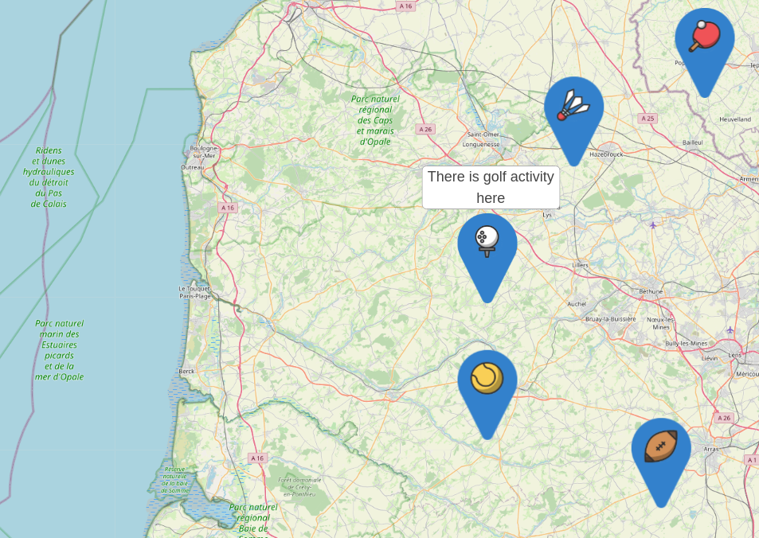

# vue leaflet custom marker

[


](https://www.npmjs.com/package/vue-leaflet-custom-marker)


ℹ️ [WIP] I started working on this package around 2021-11, but current features are usable. There are some missing features at the moment that are mostly (and untested): 
 * update marker position on coordonate update. 
 * I also wand to add support for zindex (item depth over map layout)
 * maybe I'll add custering in the future if leaflet supports it.

This component allows you to display custom HTML content on the map using Overlay.
I made this component for leaflet because I made the one for [google map](https://github.com/eregnier/vue2-gmap-custom-marker) and it was quite easy for me to adapt and do this one then.

[Demo](https://TODO/)

You might look at this [demo code repository](https://vue-leaflet-custom-marker-demo.pages.dev) for features usage and complete exemple around this plugin.

## Features

- Display reactive custom html into markers on google map using slot system

- Live property change allows simple interaction with coordonates and zindex of html marker element

- Simple positionning system for marker around the origin point

- Specific markers offset X and Y for more control about html element display

- Almost all API of the component is optional, just start with lon, lat property

## Example

TODO

<!--  -->

## Installation

Install the package from [npm](https://www.npmjs.com/package/vue-leaflet-custom-marker):

`npm i vue-leaflet-custom-marker`

## Basic Usage

Import the component and use it in the components object.

```javascript
import CustomMarker from 'vue-leaflet-custom-marker';

export default = {
  [...],
  components: {
      CustomMarker
  },
  [...]
}
```

Use the custom marker inside the map component. Add HTML or other Vue components inside the custom marker to be rendered on the map.

```vue
<template>
<l-map zoom="15" :center="marker">
  <l-tile-layer url="https://{s}.tile.openstreetmap.org/{z}/{x}/{y}.png" attribution="http://osm.org/copyright"></l-tile-layer>
  <custom-marker
    :marker="marker"
  >
    <div
      style="width: 50px; height: 50px; border: 1px solid blue"
      :style="{ 'background-color': isBlue ? 'blue' : 'red' }"
    >
      <button @click="toggle">X</button>
    </div>
  </custom-marker>
</l-map>
<template>
<script>
export default = {
  //[...],
  methods: {
    toggle () {
      this.isBlue = !this.isBlue
    }
  },
  data() {
    return {
      isBlue: false,
      marker: {
        lat: 50.60229509638775,
        lng: 3.0247059387528408
      }
    }
  //[...]
}
</script>
```


Specify the marker alignment with the `alignment` property. It accepts 13 values: `top`, `bottom`, `left`, `right`, `center`, `topleft`, `topright`, `bottomleft`, `bottomright`. Defines the alignment of the marker relative to the lat/lng specified, e.g. `bottomright` - the marker will be below and on the right of the location.

```vue
<custom-marker :marker="marker" alignment="bottomright">
  <p>content</p>
</custom-marker>
```

<!--  -->

Manually specify an offset value for the marker in pixels with prop `offsetX` | `offsetY`. A positive `offsetX` moves the marker further right, and a positive `offsetY` moves the marker further down the page. Can be used with the `alignment` prop.

```vue
<custom-marker :marker="marker" :offsetX="-10" :offsetY="17.5">
  <p>content</p>
</custom-marker>
```

## Reference

|   **Prop**    | **Type** | **Default** |                                                                        **Description**                                                                        |                                                               **Supported Values**                                                                |
| :-----------: | :------: | :---------: | :-----------------------------------------------------------------------------------------------------------------------------------------------------------: | :-----------------------------------------------------------------------------------------------------------------------------------------------: |
|   `marker`    |  Object  |   `null`    |                                Provide the latitude and longitude values that the marker should be displayed at. **Required**                                 |                                 Provide an Object with `lat` and `lng` properties. `{ lat: Number, lng: Number }`                                 |
|   `offsetX`   |  Number  |     `0`     |                          The number of pixels to move the marker by in the x-direction. Postive values move the marker to the right                           |                                                           Positive or negative number.                                                            |
|   `offsetY`   |  Number  |     `0`     |                        The number of pixels to move the marker by in the y-direction. Postive values move the marker to down the page.                        |                                                           Positive or negative number.                                                            |
|  `alignment`  |  String  |    `top`    | The alignment of the marker element relative to the location it is displayed. e.g. `bottomright` - the marker will be below and on the right of the location. | `top`, `bottom`, `left`, `right`, `center`, `topleft` `lefttop`, `topright`, `righttop`, `bottomleft`, `leftbottom`, `bottomright`, `rightbottom` |
|   `zIndex`    |  Number  |    `50`     |                                                                    z-index of the marker.                                                                     |                                                                 Positive number.                                                                  |

## Licence

[MIT](https://en.wikipedia.org/wiki/MIT_License)
